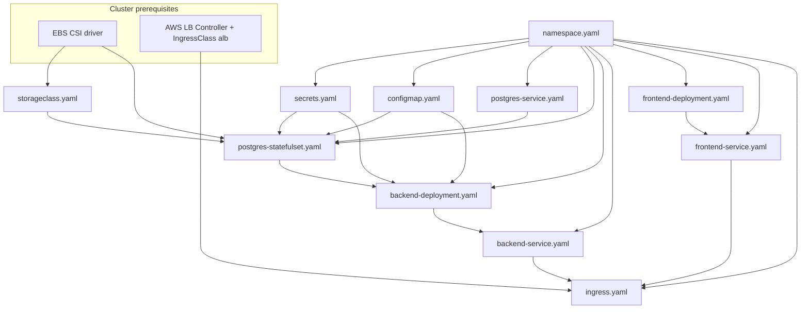

# Kubernetes manifests (`k8s/`)

This folder contains the application manifests for the **todo** demo on Kubernetes. They target the namespace **`todo-app`** and assume an **AWS EKS** cluster with the **EBS CSI driver** and **AWS Load Balancer Controller** (for `Ingress` + `StorageClass`).

## Files in this folder

| File | Kind | Scope | Purpose |
|------|------|--------|---------|
| `namespace.yaml` | Namespace | Cluster | Creates `todo-app`. |
| `storageclass.yaml` | StorageClass | Cluster | `ebs-sc` — EBS `gp3` volumes for PostgreSQL (`WaitForFirstConsumer`, `Retain`). |
| `secrets.yaml` | Secret | `todo-app` | DB credentials (`DB_USER`, `DB_PASSWORD`) for Postgres and backend. |
| `configmap.yaml` | ConfigMap | `todo-app` | Non-secret DB settings (`DB_HOST`, `DB_PORT`, `DB_NAME`). |
| `postgres-service.yaml` | Service (headless) | `todo-app` | Stable DNS for the StatefulSet (`postgres-service`, `clusterIP: None`). |
| `postgres-statefulset.yaml` | StatefulSet | `todo-app` | PostgreSQL 15 + PVC via `ebs-sc`; reads ConfigMap + Secret. |
| `backend-deployment.yaml` | Deployment | `todo-app` | API pods; init container waits for Postgres; env from ConfigMap + Secret. |
| `backend-service.yaml` | Service | `todo-app` | ClusterIP service for backend on port **8000**. |
| `frontend-deployment.yaml` | Deployment | `todo-app` | Static UI (nginx) on port **80**. |
| `frontend-service.yaml` | Service | `todo-app` | ClusterIP service for frontend on port **80**. |
| `ingress.yaml` | Ingress | `todo-app` | ALB: `/api` → backend, `/` → frontend (`ingressClassName: alb`). |
| `deploy.sh` | — | — | Optional script: kubeconfig, EBS CSI, ALB controller, then applies manifests in a safe order. |

## Recommended apply order

Apply **cluster prerequisites** first (not in this folder but required by these manifests):

1. **EBS CSI driver** — `storageclass.yaml` uses `ebs.csi.aws.com`; PVCs will not provision without it.
2. **AWS Load Balancer Controller** + **`IngressClass` `alb`** — `ingress.yaml` needs an ALB-capable controller.

Then apply the YAML files **in this order** (same sequence as `deploy.sh` for the manifests):

| Step | File(s) | Why this order |
|------|---------|----------------|
| 1 | `namespace.yaml` | All namespaced objects use `todo-app`. |
| 2 | `storageclass.yaml` | Cluster-scoped; must exist before the StatefulSet creates a PVC (`storageClassName: ebs-sc`). |
| 3 | `secrets.yaml` | Referenced by `postgres-statefulset.yaml` and `backend-deployment.yaml`. |
| 4 | `configmap.yaml` | Same — required before Postgres and backend pods start. |
| 5 | `postgres-service.yaml` | StatefulSet `serviceName: postgres-service`; headless service should exist before or with the StatefulSet (applied first here). |
| 6 | `postgres-statefulset.yaml` | Creates Postgres + PVC; depends on namespace, StorageClass, Secret, ConfigMap, and Service. |
| 7 | `backend-deployment.yaml` | Init container waits for `postgres-service:5432`; needs Secret + ConfigMap. **Apply after Postgres is ready** for a smooth rollout. |
| 8 | `backend-service.yaml` | Selects `app: backend`; can be applied right after the Deployment (order vs. Deployment is flexible). |
| 9 | `frontend-deployment.yaml` | No Kubernetes dependency on backend; can be applied in parallel with backend in practice. |
| 10 | `frontend-service.yaml` | Selects `app: frontend`; pair with frontend Deployment. |
| 11 | `ingress.yaml` | References `backend-service` and `frontend-service` by name — apply after those Services exist. |

One-shot example (from repo root, after prerequisites):

```bash
kubectl apply -f k8s/namespace.yaml
kubectl apply -f k8s/storageclass.yaml
kubectl apply -f k8s/secrets.yaml
kubectl apply -f k8s/configmap.yaml
kubectl apply -f k8s/postgres-service.yaml
kubectl apply -f k8s/postgres-statefulset.yaml
# wait until postgres-0 is Ready and PVC is Bound
kubectl apply -f k8s/backend-deployment.yaml -f k8s/backend-service.yaml
kubectl apply -f k8s/frontend-deployment.yaml -f k8s/frontend-service.yaml
kubectl apply -f k8s/ingress.yaml
```

## Dependency overview



### Object-to-object dependencies

- **`postgres-statefulset`** → namespace, **`todo-app-config`** (ConfigMap), **`todo-app-secrets`** (Secret), **`postgres-service`** (headless `serviceName`), **`ebs-sc`** (StorageClass), EBS CSI.
- **`backend-deployment`** → namespace, ConfigMap, Secret; runtime wait on **`postgres-service:5432`** (init container).
- **`ingress`** → **`backend-service`** (port 8000), **`frontend-service`** (port 80), ALB IngressClass and controller.

The frontend workloads do not mount backend settings in these manifests; routing is entirely via **Ingress** (`/api` vs `/`).

## `deploy.sh`

`deploy.sh` configures `kubectl` for a named EKS cluster, ensures **EBS CSI** and **AWS Load Balancer Controller**, then applies the manifests in the order above and waits for PVC, Postgres, and rollouts. Edit the `CONFIG` variables at the top before running. It is optional if your cluster already satisfies the prerequisites.

## Security note

`secrets.yaml` ships **sample** base64-encoded values for a demo. Replace them with your own secrets (or use an external secret manager) before using in a real environment.
